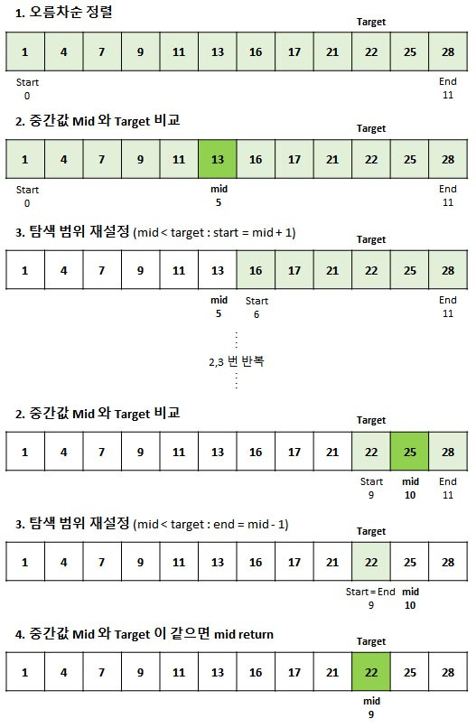

## 문제주소

> https://www.acmicpc.net/problem/10816

</br>

## 아쉬운 점

이 문제를 읽을 때 부터 범위가 커서 시간복잡도에 대해 고민을 하긴 했었다.  
아직 어떤 자료구조를 적재적소에 사용하지 못해 아쉽긴하다.  
for문으로 돌리면 무조건 시간초과가 날 것같은데 일단 시간내에 다른 방법이 생각나지 않아서 for문과 filter 함수를 이용하여 문제를 풀긴 풀었지만, 역시 시간초과가 났다.

## 개념 알고가기

### 딕셔너리 자료형

파이썬에서의 `딕셔너리`는 `키와 값`으로 이루어진 자료형이다. 각 키가 고유해야 하고 정렬되지 않은 모움이다.

딕셔너리를 생성하는 방법은 두가지

- `{}`를 사용하는 방법
- `dict()`를 사용하는 방법

```py
# 1.
my_dictionary = {}

# 2.
my_dictionary = dict()
```

## 내가 푼 코드

```py
import sys
N = int(input())
n_list = list(map(int,sys.stdin.readline().split()))

M = int(input())
m_list = list(map(int,sys.stdin.readline().split()) )

f_list = []
result = []

for i in range(M):
    f_list = []
    f_list = list(filter(lambda n:m_list[i] == n,n_list))
    result.append(len(f_list))

print(" ".join(map(str,result)))
```

---

### 내가 푼 코드 (25.7.17)

```py
N = int(input())
n_arr = list(map(int,input().split()))

M = int(input())
m_arr = list(map(int,input().split()))

answer_arr = []

for i in range(M):
    answer_arr.append(n_arr.count(m_arr[i]))

print(" ".join(str(s) for s in answer_arr))
```

시간초과가 났다~ for문도 시간복잡도가 O(n)이고 count메서드도 O(m)이기 때문에 전체적인 시간복잡도가 O(n\*m)이 되기 떄문이다.

### 모르는 개념

> Counter

`collections` 모듈의 Counter는 중복된 데이터가 저장된 배열을 인자로 넘기면 각 원소가 몇번씩 나오는지를 객체로 반환합니다.

```py
Counter(["hi", "hey", "hi", "hi", "hello", "hey"])
Counter({'hi':3, 'hey':2, 'hello': 1})
```

**Counter를 사전처럼 사용하기**
`collections` 모듈의 Counter는 파이썬 기본 자료구조인 사전(dictionary)을 확장하고 있기 때문에 사전에서 제공하는 API 그대로 사용할 수 있습니다.

1. 대괄호를 이용하여 키로 값을 읽을 수 있다.

```py
counter = Counter("hello world")
counter["o"], coutner["l"]

(2,3)
```

2. 특정 키에 해당하는 값을 갱신할 수 있다.

```py
counter["l"] +=1
counter["h"] -=1
```

따라서 위의 문제에서 이렇게 풀 수도 있겠다.

```py
from collections import Counter

counter = Counter(n_arr)

answer_arr = [str(counter[m]) if m in counter else '0' for m in m_arr]
```

<br/>

아래는 다른 사람 풀이 중 사전형으로 푼 코드이다.

### 사전형으로 푼 경우

```py
n_dic = {}

for n in n_arr:
    if n in n_dic:
        n_dic[n] +=1
    else:
        n_dic[n] = 1

print(n_dic)

for m in m_arr:
    if m in n_dic:
        print(n_dic[m], end=" ")
    else:
        print(0,end=" ")
```

### 다시 도전 (2025.08.27)

이분탐색으로 문제를 풀려다가 실패하였다.  
개념 다시 잡기!

> 이분 탐색 / 이진탐색 (Binary Search)

- 이분탐색이란, 오름차순으로 정렬된 배열을 반복적으로 나누어 target이 선택될 때까지 탐색하는 알고리즘이다.



1. 이분탐색의 조건

- 반드시 **오름차순으로 정렬**된 상태에서 시작해야한다.

2. 이분탐색 알고리즘

- **반복문**과 **재귀** 두 가지 방법을 사용할 수 있다.

1. 오름차순으로 정렬한다.
2. 배열의 중간값(mid)이 찾고지 하는 값(target)인지 비교한다.
3. mid값이 target과 다르다면 대소관계를 비교하여 탐색범위를 좁히고, target과 mid값이 같을때까지 아래 조건에 따라 2,3을 반복한다.
   a. target이 mid값 보다 작으면 emd를 mid왼쪽 값으로 바꿔준다.
   b. target이 mic값 보다 크면 start를 mid오른쪽 값으로 바꿔준다.

### 이분탐색 함수(반복문)

```py
def binary_search(target,data):
    data.sort()
    start=0
    end = len(data) -1

    while start <= end:
        mid = (start + end) // 2

        if data[mid] == target:
            return mid

        elif data[mid] > target:
            end = mid -1
        else:
            start = mid + 1
    return
```

### 이분탐색 함수(재귀)

```py
def binary_search(target, start, end):
    if start > end :
        return -1

    mid = (start + end) // 2

    if data[mid] == target:	# 중간값의 데이터가 target과 같다면 mid를 반환
        return mid

    elif data[mid] > target: # target이 작으면 왼쪽 탐색
        end = mid - 1
    else:                    # target이 크면 오른쪽 탐색
        start = mid + 1

    return binary_search(target, start, end)

def solution(target, data):
    data.sort()
    start = 0
    end = len(data) -1
    return binary_search(target, start, end)
```

- 참고 : https://chancoding.tistory.com/45
