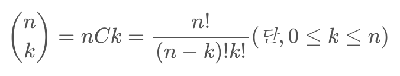

## 문제주소

> https://www.acmicpc.net/problem/11050

</br>

### 아쉬운 점

이항계수의 공식이 기억나지 않아 검색하여 문제를 풀었다.  
이항계수의 값은 파스칼의 삼각형과 같다고 하여 DP를 사용하여 문제를 풀었다.

## 코드

```py
N,K = map(int, input().split())

def dp(n,k):
    if k==0 or n==k:
        return 1
    return  dp(n-1,k-1) + dp(n-1,k)


print(dp(N,K))
```
