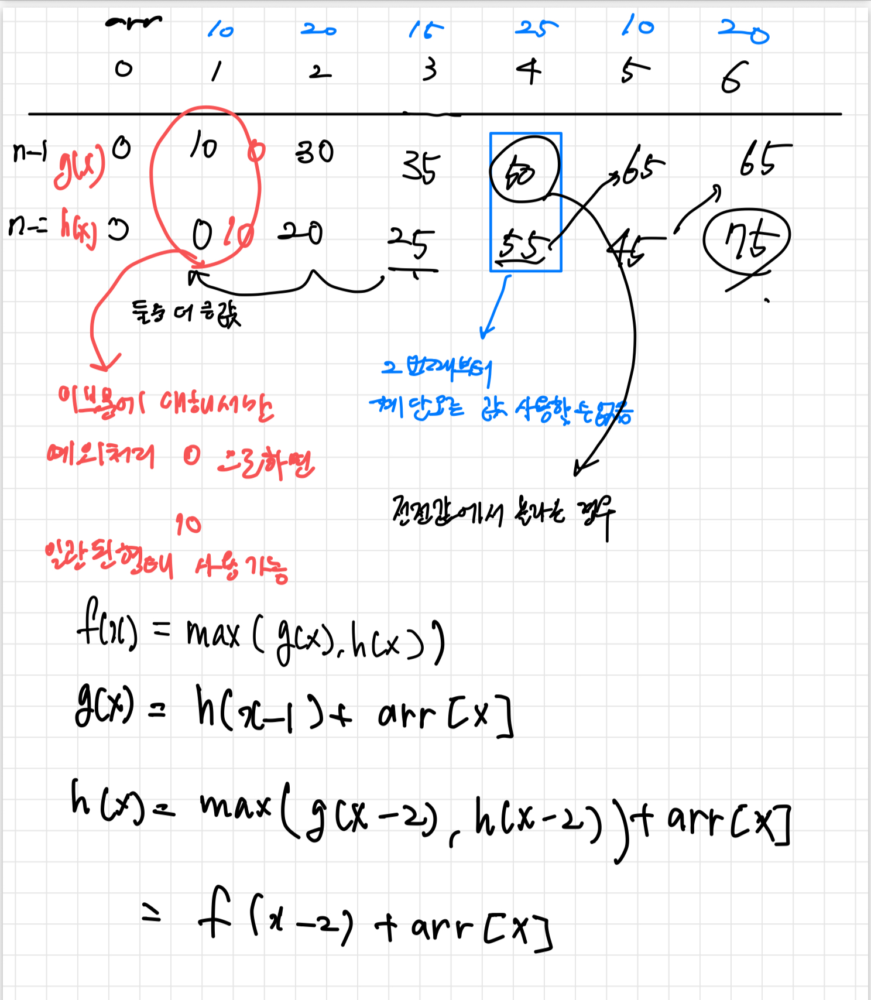

## 문제주소

> https://www.acmicpc.net/problem/2579

</br>

## 아쉬운점

해당 문제도 갈피를 잡지 못하였다.  
점화식을 만들어내는 과정이 아직 너무 어려운 것 같다.  
해당 문제는 영상 풀이를 보면서 참고하였다.

풀이를 보면서도 살짝 헷갈리는 부분이 있었다.  
조건에서 세칸 연속 밟을 수 없고 한칸 또는 두칸만 건널 수 있다.

각 계단은 x-1, x-2번째에서 올 수 있는 것을 가정하고  
x-1은 g(x)라 생각하고 x-2는 h(x)라 생각하여 값을 구하면 규칙이 보인다.



여기서 나온 점화식은 위의 사진과 같은데 일관된 코드를 사용하기 위해서  
인덱스 1번째 값만 위아래를 바꿔서 값을 적용하면 for문을 통해 일관된 코드를 작성할 수 있다.

## 다른 사람이 푼 코드

```py
T = int(input())

arr = [0]

for _ in range(T):
    x = int(input())
    arr.append(x)
# g: x-1
# h: x-2
g = [0,0]
h = [0,arr[1]]
for i in range(2,T+1):
    g.append(h[i-1]+arr[i])
    h.append(max(g[i-2],h[i-2])+arr[i])

print(max(g[T],h[T]))
```
