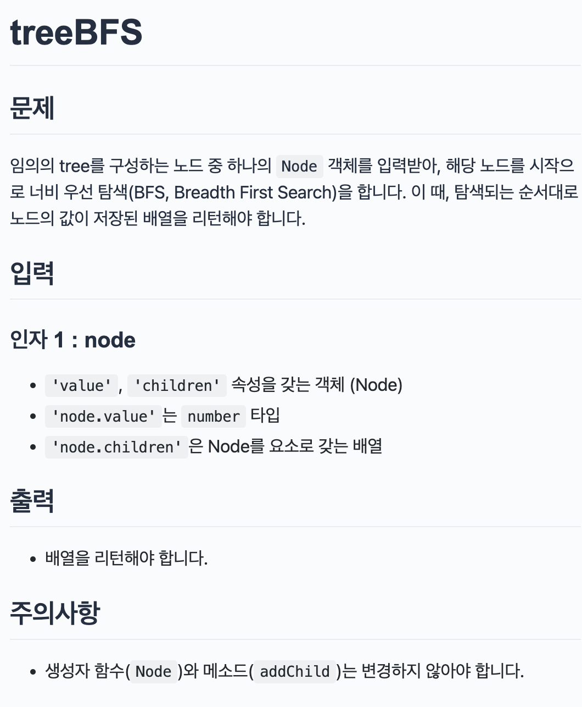

## 문제

> 

</br>

## 문제 접근 방법

배열 `queue`에 node를 넣고 queue의 길이가 0 이하일 때 while문은 멈춥니다.  
너비우선이므로 각 레벨에 있는 것들을 차례대로 출력해야 합니다.  
따라서 `head`변수에 `queue[0]`을 넣어주고 queue는 다시 `queue[0]`을 뺀 값으로 재정의합니다.  
`result `배열에 head.value값을 push하고 head의 자식 배열을 돌면서 같은 동작을 반복합니다.

</br>

## 코드

```js
let bfs = function (node) {
  let queue = [node];
  const result = [];
  while (queue.length > 0) {
    const head = queue[0];
    queue = queue.slice(1);
    result.push(head.value);
    head.children.forEach((child) => queue.push(child));
  }
  return result;
};

let Node = function (value) {
  this.value = value;
  this.children = [];
};

Node.prototype.addChild = function (child) {
  this.children.push(child);
  return child;
};

let root = new Node(1);
let rootChild1 = root.addChild(new Node(2));
let rootChild2 = root.addChild(new Node(3));
let leaf1 = rootChild1.addChild(new Node(4));
let leaf2 = rootChild1.addChild(new Node(5));
let output = bfs(root);
console.log(output); // --> [1, 2, 3, 4, 5]

leaf1.addChild(new Node(6));
rootChild2.addChild(new Node(7));
output = bfs(root);
console.log(output); // --> [1, 2, 3, 4, 5, 7, 6]
```
