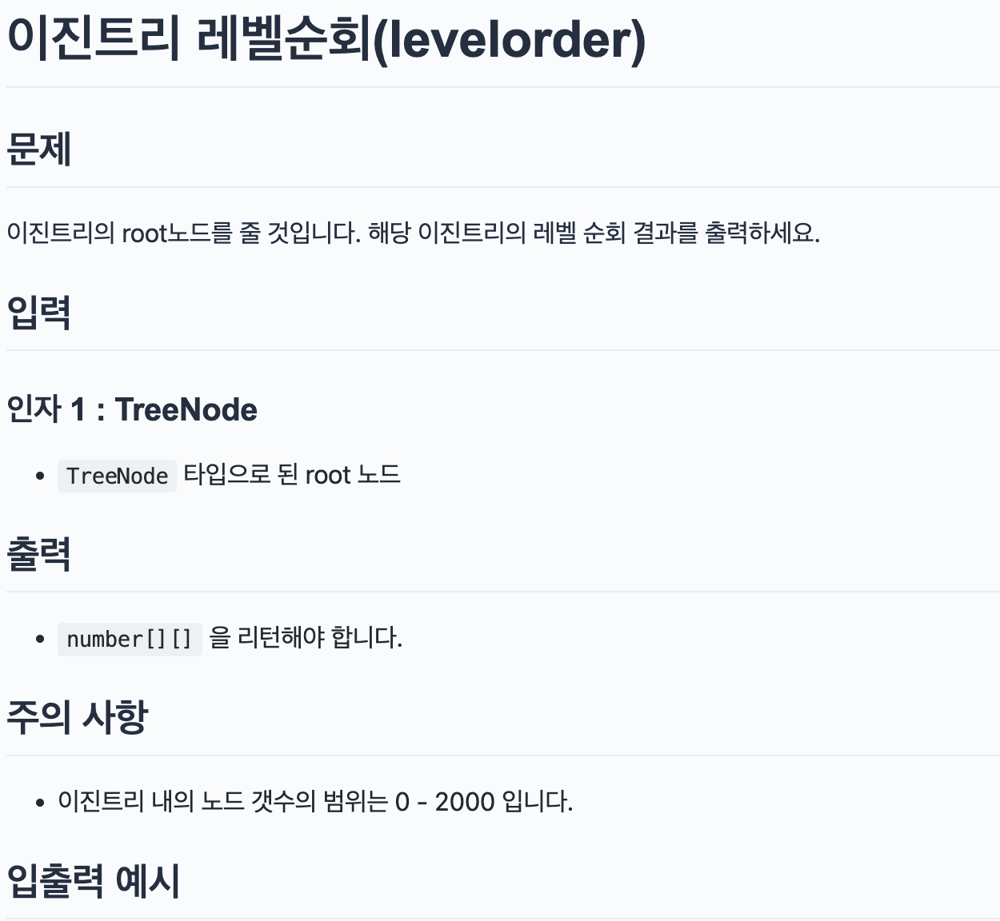

## 문제

> 

</br>

## 아쉬운 점
아직 자료구조에 대한 알고리즘을 문제를 풀고 바로 코드로 써내려 가지 못한다.  
그러므로 최대한 이해하려고 하기 자주 문제를 풀어봐야 할 것 같다.


</br>

## 코드

```js
// Definition for a binary tree node.
// class TreeNode {
//   constructor(val = 0, left = null, right = null) {
//   this.val = val;
//   this.left = left;
//   this.right = right;
//   }
// }
/**
 * @param {TreeNode} root
 * @return {number[]}
 */
const levelOrderTraversal = (root) => {
  let result = [];
  if (!root) return result;

  const queue = [];
  queue.push(root);
  while (queue.length > 0) {
    //queue에 더이상 값이 없을 때 까지
    const level = [];
    const size = queue.length;
    console.log(size);
    for (let i = 0; i < size; i++) {
      const node = queue.shift();
      level.push(node.val);

      node.left && queue.push(node.left);
      node.right && queue.push(node.right);
    }
    result.push(level);
  }
  return result;
};
class TreeNode {
  constructor(val, left, right) {
    this.val = val === undefined ? 0 : val;
    this.left = left === undefined ? null : left;
    this.right = right === undefined ? null : right;
  }
}

/*
        3
       / \
      9  20
        /  \
       15   7
*/
const root1 = new TreeNode(
  3,
  new TreeNode(9),
  new TreeNode(20, new TreeNode(15), new TreeNode(7))
);
const result1 = levelOrderTraversal(root1);
console.log(result1); // [[3], [9, 20], [15, 7]];

const root2 = new TreeNode(1);
const result2 = levelOrderTraversal(root2);
console.log(result2); // [[1]]

const root3 = null;
const result3 = levelOrderTraversal(root3);
console.log(result3); // []

```
### 코드 해설
queue에 매개변수로 받아온 root을 넣고 더이상 배열이 남지 않을 때 까지 while문을 돌립니다. 레벨 순회이므로 각 레벨에 있는 길이만큼 for문을 돕니다.  
제일 첫 번째 있는 값을 shift()메서드를 사용해 얻어냄과 동시에 배열에서 제거합니다.  
첫번째 값을 level 배열에 넣어줍니다.  
그리고 그 값의 left와 right가 있으면 queue에 해당 배열을 넣어줍니다. 