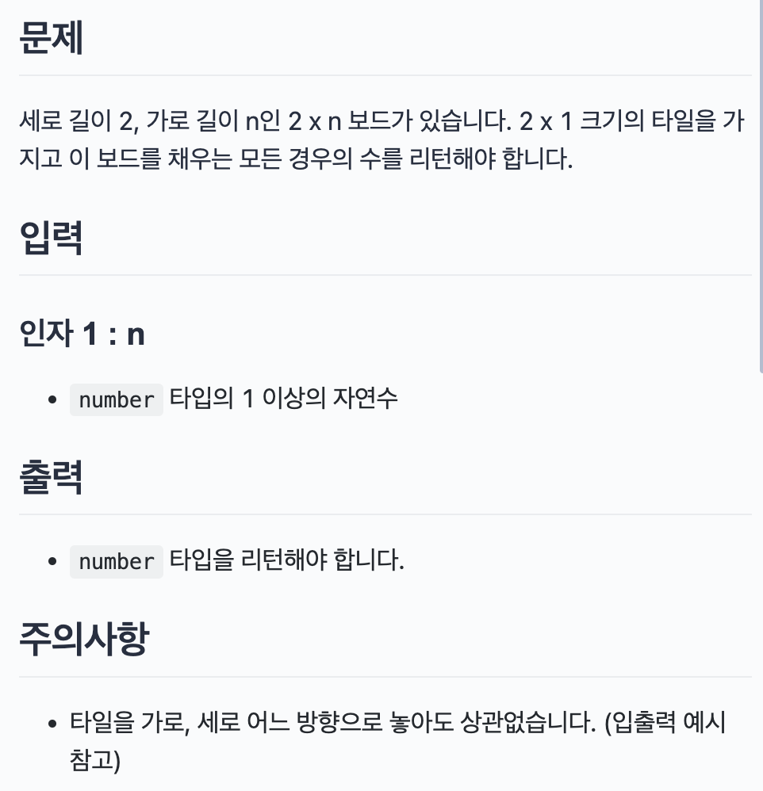

## 문제



</br>

## 문제 접근 방법
맨 처음 queue 배열에 boxes[0]번째 값을 넣어줍니다. 반복문을 돌면서 첫번째 값보다 작은 수면 queue에 push 해줍니다. push 해줄때 마다 count는 1씩 증가합니다.  
만약 큰 수를 만나면 max를 재정의하고 start는 현재 들어온 값으로 지정해주고 다시 queue에 start를 넣어주고 count도 초기화를 시켜준 다음 반복문을 돕니다.  
하지만 제가 적은 코드는 테스트는 다 맞게 나오는데 제출하는 페이지에서 통과되지 않습니다.  


</br>

## 코드
### 내가 푼 코드
```js
const paveBox = (boxes) => {
  let queue = [];
  let max = 0;
  let count = 1;
  queue.push(boxes[0]);
  let start = queue[0];

  for (let i = 1; i < boxes.length; i++) {
    if (start >= boxes[i]) {
      queue.push(boxes[i]);
      console.log(queue)
      count++;
      
    } else {
      max = max < count ? count : max;

      start = boxes[i];
      queue.push(start);
      count = 1;
    }
  }
  max = max <= count ? count : max;

  return max;
};
```
### 레퍼런스 코드
```js
const paveBox = (boxes) => {
  let answer = [];
  let finishIndex = boxes.findIndex((fn) => fn > boxes[0]);
  console.log(finishIndex);
  while(boxes.length>0){
    let finishIndex = boxes.findIndex(fn=>fn>boxes[0])

    if(finishIndex === -1){
      //찾지 못했다면
      answer.push(boxes.length)
      boxes.splice(0,boxes.length)
    }else{
      answer.push(finishIndex)
      boxes.splice(0,finishIndex)
    }
  }
  return Math.max(...answer)
};
```
findIndex 메서드를 사용해서 boxes[0]보다 큰 값 중 첫번째 값을 finishIndex에 저장한다.  
그리고는 boxes.length가 0보다 작을 때 while문을 멈춘다.  
finishIndex를 찾지 못했다면 boxes.length의 길이 만큼 다 작업을 한 것이니 answer 배열에 boxes.length를 넣는다.   
만약 finishIndex를 값이 있다면 finishIndex를 answer에 넣어주고 boxes 배열을 재정의 한다.