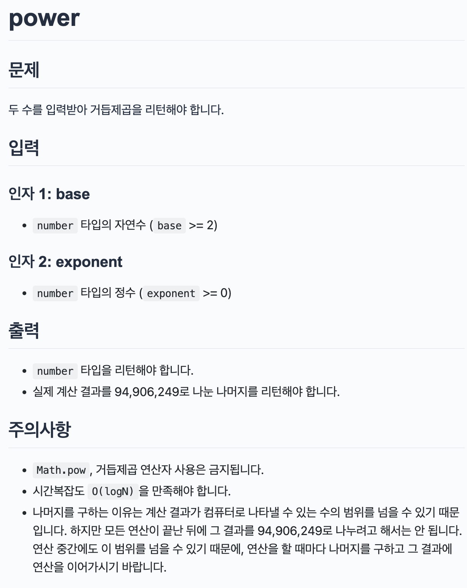

## 문제

> 

</br>

## 문제 접근 방법

처음엔 재귀나 반복문으로 풀었는데 이러한 방법은 시간복잡도가 O(n)이다.  
이렇게 풀 경우에는 제곱근 수가 높을수록 상당히 불리하다.  
exponent가 짝수와 홀수일 때를 나누어 구할 수 있다.

</br>

## 코드

```js
function power(base, exponent) {
  // todo: 여기에 코드를 작성합니다.
  // 두 수를 입력받아 거듭제곱 리턴
  if (exponent === 0) return 1;

  const half = Math.floor(exponent / 2);
  const temp = power(base, half);
  const result = (temp * temp) % 94906249;
  if (exponent % 2 === 0) {
    // 짝수이면
    return result;
  } else {
    return (result * base) % 94906249;
  }
}
```
