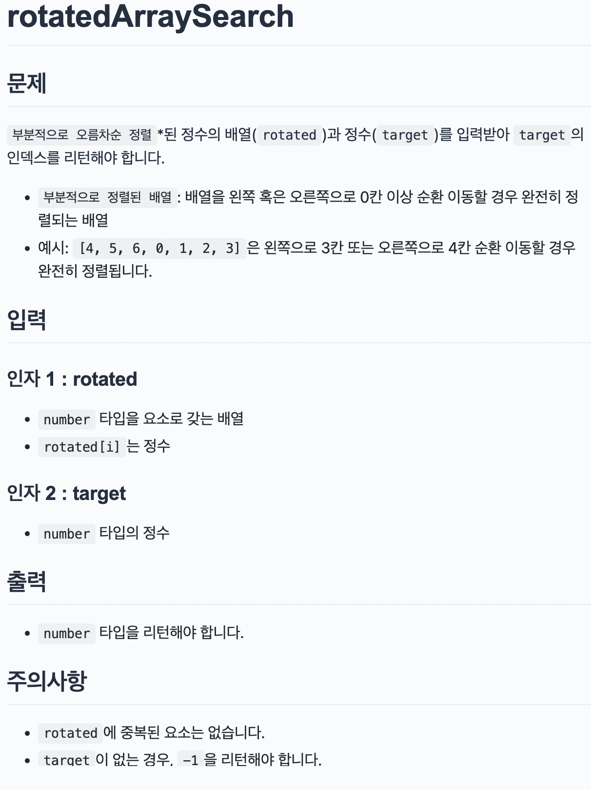

## 문제

> 

</br>

## 문제 접근 방법
처음 인덱스와 값을 객체로 만들어 배열을 만들고(배열 정렬하기 위해) while문은 구글링하여 참고하였습니다.   
`start가` `end`보다 커지는 시점에 while문을 멈춥니다.  
mid보다 `target`이 크면 `mid` 오른쪽 배열만 확인하고 mid보다 작으면 왼쪽 배열만 확인합니다.
제가 작성한 코드는 테스트 코드는 다 맞게 나오는데 
> npm ERR! Test failed. See above for more details.  

이러한 에러가 뜨네요. 혹시 이 글을 본다면 ..! 이유를 안다면 ..! 댓글 부탁드립니다..!  

</br>

## 코드
### 내가 작성한 코드
```js
const rotatedArraySearch = function (rotated, target) {
  // TODO : 여기에 코드를 작성합니다.
  let start = 0, end = rotated.length-1;
  let mid 
  let rotatedArr  = []
  rotated.forEach((num,i)=>{
    rotatedArr.push({index:i,value:num})
  })
  rotatedArr = rotatedArr.sort((a,b)=>a.value-b.value)

  while(start<=end){
  mid= parseInt((start+end)/2)
    console.log(end)
    if(target===rotatedArr[mid].value){
      return rotatedArr[mid].index
    }else{
      if(target<rotatedArr[mid].value){
        end = mid-1;
      }else{
        start = mid+1;
      }
    }
  }
  return -1;
};
```
### 레퍼런스 코드
```js
const rotatedArraySearch = function (rotated, target) {
  let left = 0,
    right = rotated.length - 1;

  while (left <= right) {
    let middle = parseInt((right + left) / 2);

    if (rotated[middle] === target) {
      return middle;
    }

    if (rotated[left] < rotated[middle]) {
      // 왼쪽 절반이 정렬되어 있는 상태
      if (target < rotated[middle] && rotated[left] <= target) {
        right = middle - 1;
      } else {
        left = middle + 1;
      }
    } else {
      // 오른쪽 절반이 정렬되어 있는 상태
      if (target <= rotated[right] && rotated[middle] < target) {
        left = middle + 1;
      } else {
        right = middle - 1;
      }
    }
  }

  return -1;
};
```