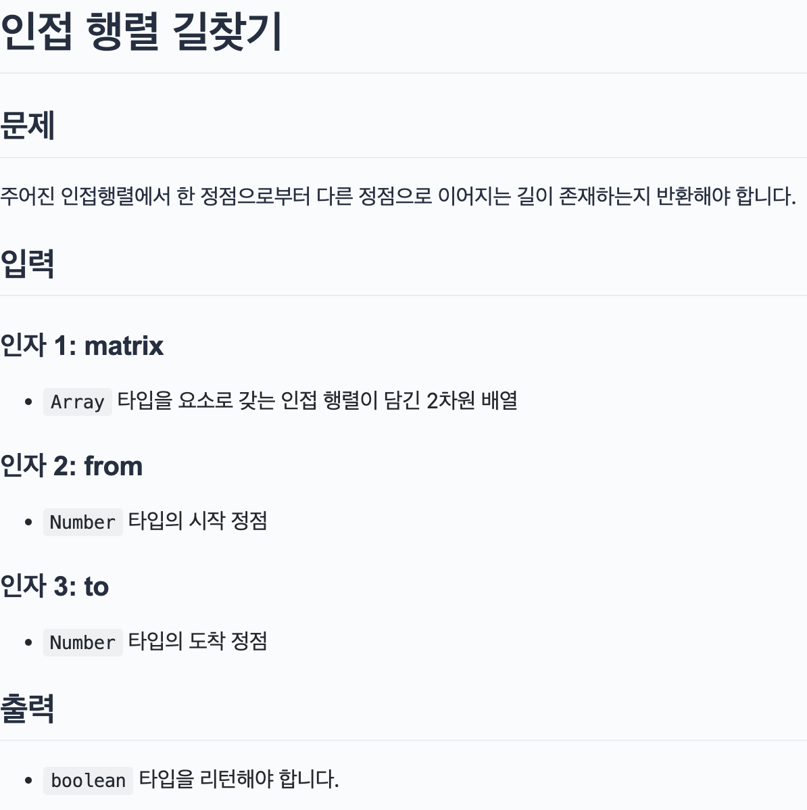

## 문제

> 

</br>

## 문제 접근 방법

아직 정확한 while문이 종료해야 하는 조건을 못 찾아 for문으로 테스트 하는 중이다.  
path라는 배열을 만들고 방문했던 index를 추가한다. 만약 이전에 값던 index라면 continue를 하고 아니라면 path에 추가한다. index와 to가 동일하면 true값을, for문을 빠져 나온 뒤 index와 to가 같지 않다면 false를 리턴한다.  
아직 모든 테스트가 맞지 않아 더 고쳐야할 것 같다.  


레퍼런스 코드를 보고 다시 진행을 하였다.   
해당 지점에 도착하면 `dequeue` 함수를 진행하여 `queue`의 배열에 있는 값을 삭제와 동시 가져와 now라는 변수로 지정해주었다.  
`matrix[now] `행렬를 for문을 돌아서 해당 지점이 1인값과 `isVisited` 배열에 인덱스가 false인 지점이여야만 다음 경로가 될 수 있으면 enqueue 함수를 통해 queue에 next 인덱스 값을 넣고 방문했으니 true로 값을 주고 다시 while문을 반복한다.  
queue의 길이가 0이 될 때까지 반복하고 그 사이 now가 to와 같으면 true를 반환, 그렇지 않다면 while문을 빠져나와 false를 반환한다.
</br>

## 내가 작성한 코드

```js
function getDirections(matrix, from, to) {
  // TODO: 여기에 코드를 작성합니다.
  const path = [];
  if(!from &&!to) return false;
  let index = from;

  path.push(index)

  for(let i=0;i<matrix.length;i++){

    if(to === index)
      return true;
    if(index){
      index = matrix[index].findIndex((num) => num === 1);
    }
     // 행이 0인 배열 중 1인 인덱스 찾음.

    if(path.includes(index)){
      continue;
    }
    path.push(index)


  }
  if(index !==to) return false;
}
```
## 레퍼런스 코드 
```js
function getDirections(matrix, from, to) {
  // TODO: 여기에 코드를 작성합니다.
  console.log(matrix.length);
  let queue = [from];

  const enqueue = (n) => queue.push(n);
  const dequeue = (n) => queue.shift();

  const isVisited = Array(matrix.length).fill(false);
  isVisited[from] = true;

  while (queue.length > 0) {
    const now = dequeue(queue); // 지금 있는 곳

    if (now === to) return true;

    for (let next = 0; next < matrix[now].length; next++) {
      if (matrix[now][next] && !isVisited[next]) {
        // 경로에 1이 있고 false이면
        enqueue(next);
        isVisited[next] = true;
      }
    }
  }

  return false;
}
```

### 입출력 테스트
```js
const result = getDirections(
	[
		[0, 1, 0, 0],
		[0, 0, 1, 0],
		[0, 0, 0, 1],
		[0, 1, 0, 0],
	],
	0,
	2
);
console.log(result); // true
// 정점 0에서 2로 가는 길이 존재하는지 확인합니다.
// 0 --> 1 로 가는 간선이 존재하고, 1 --> 2 로 가는 간선이 존재하기 때문에 true를 반환합니다.

const result2 = getDirections(
	[
		[0, 1, 0, 0, 0],
		[0, 0, 0, 1, 0],
		[0, 1, 0, 0, 0],
		[0, 1, 1, 0, 0],
		[1, 1, 1, 1, 0],
	],
	1,
	4
);
console.log(result2); // false

// 정점 1에서 4로 가는 길이 존재하는지 확인합니다.
// 1 --> 3,
// 3 --> 1 (정점 1을 다녀왔으니 다시 돌아가지 않습니다),
// 3 --> 2,
// 2 --> 1 (정점 1을 다녀왔으니 다시 돌아가지 않습니다)
// ...으로, 4에 도달할 수 없습니다.
```
